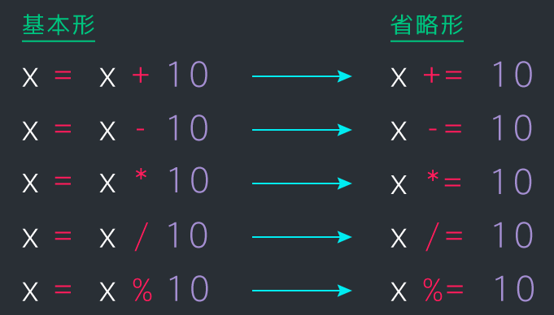

## 変数について

### なぜ変数を使うのか？
1. 同じ値を繰り返し使える
2. 変更に対応しやすい
3. 値の意味がわかりやすい

```rb
let text="おはようございます"；
console.log("ジスさん、"+ text);
console.log("ジェニーさん、"+ text);
console.log("リサさん、"+ text);
//「おはようございます」を「こんにちは」に一括で変更できる
```

### 変数の命名ルール
◎良い例<br>
number・・・◎英単語を用いる
oddNumber・・・◎2語以上の場合は大文字で区切る

×悪い例<br>
1number・・・×数字開始<br>
bango・・・△ローマ字<br>
番号・・・△日本語

### 省略した書き方
<br>
上記は、「number +=1」を 「number ++」に省略して書くことができる<br>
ex.「number -=1」を 「number --」
